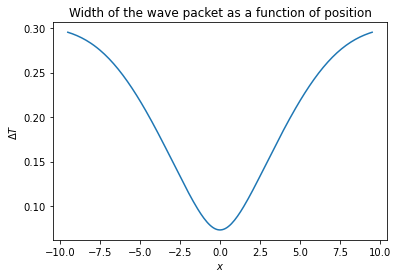

# Numerical solving and plotting the evolution 'n spreading of gaussian wave packet in space-time symmetric quantum formalism

Our intention now turns to proposing an analytical solution to equation (5.6) of Ricardo's thesys. This problem has already been analyzed in different ways, and it has been shown that for a free particle problem, there is a closed form for its solution as in [ref. session 2.4](https://repositorio.ufpe.br/bitstream/123456789/29706/1/DISSERTA%C3%87%C3%83O%20Ricardo%20Alexandre%20dos%20Santos%20Ximenes%20Filho.pdf). Now, let's show that for a wide range of physical systems, which are under the action of a potential independent of time, it is possible to use a similar technique to obtain a general solution. Recalling that:


$$\sqrt{2m} \hat{\sigma_z}  [i \hbar \frac{\partial}{\partial t} - V(T,x)]^{1/2} \phi (t|x)  = -i \hbar \frac{\partial}{\partial x}  \phi (t|x) \tag{1}$$

Analogously to the reference for free particle solution, we can use a separation of variables in the form $\phi(t|x) = e^{-i\epsilon t/ \hbar} \phi_\epsilon (x)$, and by the same argument of series expansion it's clear that

$$\hat{\sigma_z} \sqrt{2m [\epsilon - V(x)]} \phi_\epsilon (x) = -i \hbar \frac{d}{dx} \phi_\epsilon (x) \tag{2}$$

This is a first-order differential equation whose solution is given by

$$\phi_\epsilon (x) = \frac{1}{\sqrt{2 \pi \hbar}} e^{(i/\hbar)\hat{\sigma_z} \int_{0}^{x} \sqrt{2m [\epsilon - V(x)]} dx^{\prime}} \tag{3}$$

So, since (3) is still a linear equation, we can write the general solution so that

$$\phi (t|x) = \frac{1}{\sqrt{2 \pi \hbar}} \int d\epsilon C_\epsilon  e^{(i/\hbar)\hat{\sigma}_z \int_{0}^{x} \sqrt{2m [\epsilon - V(x)]} dx^{\prime}-i\epsilon t /\hbar}  \tag{4}$$

Or in terms of the classical momentum's $P(\epsilon, x) = \pm \sqrt{2m\epsilon} $

$$ \phi (t|x) = \frac{1}{\sqrt{2 \pi \hbar}} \int  d\epsilon C_\epsilon e^{(i/\hbar)  \int_{0}^{x} P(\epsilon; x^{\prime}) dx^{\prime}-i\epsilon t /\hbar} \tag{5}$$

In order to solve then analytically for any potential $V(x)$ one need only to perform the integration in the exponential argument to obtain the general solution of the problem. At first glance, this simplicity can seem strange, after all, for the Schrödinger equation we don't have a uniquely shaped solution for every $V(x)$. However, this result is somewhat expected: first, analyzing Eq. (5.6) of the thesys, we see that the potential $V(x,t) = V(x)$ we choose only depends on the conditional parameter of this equation, i.e., of the $x$ position. Thus, if we want to obtain an equivalent result in the Schrödinger equation, we must choose a potential $V(x,t)$ that only depends on the conditional parameter t of this equation, so we will find the same result in the symmetric construction of quantum mechanics.

Proceeding with the solution, let us first consider the simplest case to be that of a free particle, where the potential will then be given by $V(x) = 0$. If we then apply these conditions to equation (4) and consider only the positive branch of the solution matrix $\hat{\sigma_z}$ we will reduce it to

$$\phi (t|0) = \frac{1}{\sqrt{2 \pi \hbar}} \int d\epsilon C_\epsilon  e^{(-i  \epsilon  t/\hbar)}  \tag{6}  $$

Note here that we are now going to proceed in [very similar](https://www.asc.ohio-state.edu/jayaprakash.1/631/freegauss.pdf) to what is done in the traditional construction of quantum theory, with the aim now to evolve spatially through the fourier transform the conditional space wave function of our theory

Taking 
$$\phi (t|0) = \frac{1}{\sqrt{2 \pi \hbar}} \exp{\left[\frac{-(t-t_0)^2}{2 \sigma^2} \right]} \exp{\left[\frac{i \epsilon_0 t}{\hbar} \right]} \tag{7}$$ 

As an initial condition, where you notice that I set a  Gaussian in $x=0$ with standard deviation $\sigma$, we follow [applying the Fourier transform](https://www.wolframalpha.com/input/?i=Fourier+transform+calculator&assumption=%7B%22F%22%2C+%22FourierTransformCalculator%22%2C+%22transformfunction%22%7D+-%3E%22%281%2Fsqrt%282*pi*h%29+%29*+e%5E%28-%28t-T%29%5E2%2F%282*a%5E2%29%29*e%5E%28i*e*t%2Fh%29%22&assumption=%7B%22F%22%2C+%22FourierTransformCalculator%22%2C+%22variable1%22%7D+-%3E%22t%22&assumption=%7B%22F%22%2C+%22FourierTransformCalculator%22%2C+%22variable2%22%7D+-%3E%22w%22) already substituting for the coordinate $\epsilon$ so that

$$\phi(t|0) = \int_{-\infty}^{\infty} \frac{d \epsilon}{\sqrt{2 \pi \hbar}} \psi(\epsilon) e^{i \epsilon t} \tag{8} $$


$$\psi(\epsilon) \equiv C_\epsilon = \int_{-\infty}^{\infty} \frac{1}{\sqrt{2 \pi\hbar} } \left ( \frac{1} {\sqrt{2\pi \hbar}} e^{-(t-t_0)^2/(2 \sigma^2)} e^{(i \epsilon_0 t)/\hbar} \right ) e^{ -i\epsilon t} dt$$

$$= \frac{1}{ 2 \pi \hbar}   \int_{-\infty}^{\infty} \left (  e^{-(t-t_0)^2/(2 \sigma^2)}  e^{(i \epsilon_0 t)/\hbar} \right )  e^{-i \epsilon t} dt$$

$$ = \frac{1}{ 2 \pi \hbar} \frac{\exp{\left ( - \frac{(\epsilon_0 + \hbar \epsilon)\left ( \sigma^2(\epsilon_0 + \hbar \epsilon)-2i \hbar t_0 \right ) }{2 \hbar^2} \right )}}{\sqrt{\frac{1}{\sigma^2}}}$$

$$=  \frac{\sigma^2}{ 2 \pi \hbar} \exp{\left ( - \frac{(\epsilon_0 + \hbar \epsilon)\left ( \sigma^2(\epsilon_0 + \hbar \epsilon)-2i \hbar t_0 \right ) }{2 \hbar^2} \right )} \tag{9}$$

What this is telling us is that the Gaussian time wave function is a superposition of different energies, with the probability of finding these energies between $\epsilon_1$ and $\epsilon_1 + d \epsilon$ being proportional to $ \exp{\left ( - \frac{(\epsilon_0 + \hbar \epsilon)\left ( \sigma^2(\epsilon_0 + \hbar \epsilon)-2i \hbar t_0 \right ) }{2 \hbar^2} \right ) } d\epsilon$. In order to recap, it is worth recalling the development of this problem within the scope of traditional theory, proceeding in the same way and applying a Fourier transform into a Gaussian and obtaining another Gaussian. Note here that the results obtained are, as well as those proposed, symmetrical and equivalent. We will also point out that our initial wave function (5) which represents the solution found to the Schroedinger equation conditional space represents a superposition of different plane waves associated with different coefficients (which we usually refer to as amplitudes).

Now, finally in possession of the coefficients $C_\epsilon$ we can substitute back the results in (7.5) and obtain the result of the space-conditional wavefunction given an initial Gaussian space-boundary condition.

As we also have the general result for $\phi(t|x)$ in the case of the free particle, we can substitute in (7.4) the value found for $C_\epsilon$ and understand how the wave function will propagate in all instants of time t, given that we are going to observe it in a known space x.

- [Evolved space result](https://www.wolframalpha.com/input/?i=integrate+&assumption=%7B%22F%22%2C+%22Integral%22%2C+%22variable%22%7D+-%3E%22%CE%B5%22&assumption=%7B%22C%22%2C+%22integrate%22%7D+-%3E+%7B%22Calculator%22%7D&assumption=%7B%22F%22%2C+%22Integral%22%2C+%22integrand%22%7D+-%3E%22e%5E%28-%28O%2Bh*%CE%B5%29%28a%5E2%28O%2B+h*%CE%B5%29-2*i*h*T%29%2F%282*h%5E2%29%29*e%5E%28%28i%2Fh%29*%28sqrt%282*m*%CE%B5%29*x%29-i*%CE%B5*t%2Fh%29%22)

$$ \phi (t|x) = \frac{1}{\sqrt{2 \pi \hbar}} \int d\epsilon \frac{\sigma^2}{ 2 \pi \hbar} \exp{\left ( - \frac{(\epsilon_0 + \hbar \epsilon)\left ( \sigma^2(\epsilon_0 + \hbar \epsilon)-2i \hbar t_0 \right ) }{2 \hbar^2} \right )}  e^{(i/\hbar)  \sqrt{2m\epsilon} x-i\epsilon t /\hbar }  \tag{10}$$

$$=\frac{\sigma^4}{(2 \hbar \pi )^{3/2}} \int d\epsilon \exp{\left ( - \frac{(\epsilon_0 + \hbar \epsilon)\left ( \sigma^2(\epsilon_0 + \hbar \epsilon)-2i \hbar t_0 \right ) }{2 \hbar^2} \right )}  e^{(i/\hbar)  \sqrt{2m\epsilon} x-i\epsilon t /\hbar}\tag{11} $$

$$ =\text{integral não tem solução analítica} \blacksquare $$ 
$$\text{(note que ela não divergiu, apenas não tem solução analítica. Integrando numericamente para todas as constantes = 1 obtemos para a condição inicial: 1.390521824852123 + 0.2928372699906291 i)}  $$

In order to eliminate the root of the exponent that makes this integration impossible, we can then use the construction of $\epsilon$ that as $P = \pm \sqrt{2 m \epsilon}$, that is, $ \epsilon_p = P^ 2/2m$. By carrying out this replacement, we will obtain that:

$$\epsilon_p = \frac{P^2}{2m} \Rightarrow d\epsilon = \frac{P}{m} dP \tag{12}$$

Then, proceeding with the integration from 0 to $\infty$ (by replacing the $P^2$ of the exponent of $C_P$)

$$ \phi (t|x) = \frac{1}{\sqrt{2 \pi \hbar}} \int  dP \frac{P }{ m} \frac{\sigma^2}{ 2 \pi \hbar} \exp{\left ( - \frac{(P_0 + \frac{\hbar P^2}{2 m})\left ( \sigma^2(P_0 + \frac{\hbar P^2}{2 m})-2i \hbar t_0 \right ) }{2 \hbar^2} \right )}  e^{(i/\hbar) P x - i P^2 t /2 m \hbar } \tag{13} $$

 $$\phi (t|x) = \frac{\sigma^2}{ (2 \pi \hbar)^{3/2} m} \int  dP  P \exp{\left ( - \frac{(P_0 + \frac{\hbar P^2}{2 m})\left ( \sigma^2(P_0 + \frac{\hbar P^2}{2 m})-2i \hbar t_0 \right ) }{2 \hbar^2} \right )}  e^{(i/\hbar) P x - i P^2 t /2 m\hbar }  \tag{14}$$

*Note: I was unable to continue analytically here, however I was able to computationally solve/plot the integral above; I can then work on additional computational graphics from there

## Numerical evolution for integrals without analytical solution


```python
import quadpy
import math as math
from math import e
from math import pi
from math import sqrt
import numpy as np
from scipy import integrate
import matplotlib.pyplot as plt
import cmath

#definindo unidade imaginária:
i = 0 + 1j

#criando a função para o plot
def plot_results(sigma = 1, Xp = 1, m=1, P_0 = 1, hbar = 1):

    #preparando a função que vai ser integrada para a integração 
    def f(x, t):
        res = (sigma**2)/(2*pi*hbar)**(3/2)*x*e**(-(P_0 + hbar*(x**2)/(2*m))*(sigma**2)*(P_0 + hbar*(x**2)/(2*m))/(2*hbar**2))*cmath.exp((i/hbar)*x*Xp - i*(x**2)*t/(2*m*hbar))
        return res
    integral = np.vectorize(f)

    #efetuando a integral 
    def F(t):
        xmin = 0
        xmax = 10
        y,err = quadpy.quad(lambda x: integral(x,t), xmin, xmax)
        return y
    Fvec = np.vectorize(F)
    
    t = np.linspace(-5,80,200)
    plt.plot(t, abs(Fvec(t))**2)
    plt.title('Numerical evolution of the probability density of Gaussian wave packet')
    plt.ylabel('$|\phi(t|x)|^2$')
    plt.xlabel('$t$')
    
    

from ipywidgets import interact, fixed

interact(plot_results, sigma=(0.0,1.5), Xp=(0,40), m=fixed(1), hbar=fixed(1), P_0=fixed(1));

```


    interactive(children=(FloatSlider(value=1.0, description='sigma', max=1.5), IntSlider(value=1, description='Xp…


Above, the automated scheme of the numerical evolution of the most general form of the Gaussian package, where I can put as an interactive variable any interesting quantity for discussion. For a static view I suggest the following view template

 

Now, with the above script, we can use the following result for the exponential integral that contains the potential; as a souvenir, eq. (4) tells us that:

$$\phi (t|x) = \frac{1}{\sqrt{2 \pi \hbar}} \int d\epsilon C_\epsilon  e^{(i/\hbar)\hat{\sigma_z} \int_{0}^{x} \sqrt{2m [\epsilon - V(x)]} dx^{\prime}-i\epsilon t /\hbar}  \tag{4}$$

So, proceeding with an arbitrary phisycal potential, let's say the potential of a harmonic oscillator $ V(x) = -kx^2 $, we can solve the above as 

$$I = \int_0^x \sqrt{2m\left[ \epsilon - kx^{\prime 2}\right]} dx^\prime \Rightarrow \sqrt{2m} \int_0^x \sqrt{\epsilon - kx^{\prime 2}} dx^\prime \tag{19}$$
Replacing as $x^\prime = \frac{\sqrt{\epsilon} \tan u}{\sqrt{k}} \rightarrow u = \arctan \left( \sqrt{\frac{k}{\epsilon}} u \right); dx^\prime = \sqrt{\frac{k}{\epsilon}} \sec^2(u) $, so
$$ = \int \frac{\sqrt{\epsilon} \sec^2 (u) \sqrt{\epsilon \tan^2 (u) + \epsilon}}{\sqrt{-k}} du \tag{20}$$
with $ \epsilon \tan^2 u + \epsilon = \epsilon \sec^2 u$
$$ = \int \frac{\sqrt{\epsilon} \sec^2 (u) \sqrt{\epsilon \tan^2 (u) + \epsilon}}{\sqrt{-k}} du= \sqrt{\frac{2 m}{-k}} \epsilon \int \sec^3 u du \tag{21}$$
that is, by the formula
$$ \int \sec^n (u) du = \frac{n - 2}{n - 1} \int \sec^{n-2} (u) du + \frac{sec^{n-2}(u)\tan(u)}{n - 1} \tag{21}$$
With n = 3,
$$ = \frac{\sec(u)\tan(u)}{2} + \frac{1}{2} \int \sec(u) du \tag{23}$$
our initial integral then equates to

$$ =\frac{\epsilon}{2} \sqrt{\frac{2m}{k}} \left[ \sec (u) \tan (u) + \ln \left(\sec(u) \tan(u) \right)  \right] \tag{24}$$

removing u from the expression, where 
$\tan \left( \arctan \left[ \sqrt{\frac{k}{\epsilon}} x^{\prime} \right] \right) = \sqrt{\frac{k}{\epsilon}} x^{\prime}$ also $\sec \left( \arctan \left[ \sqrt{\frac{k}{\epsilon}} x^{\prime} \right] \right) = \sqrt{\frac{k x^{\prime2}}{\epsilon} + 1}$ we obtain that 

$$ = \sqrt{2m} \left[ \frac{\epsilon  \ln \left( \sqrt{1 - \frac{kx^2}{\epsilon}} + \sqrt{\frac{-k}{\epsilon}} x^{\prime} \right) }{2 \sqrt{-k}} + \frac{\sqrt{\epsilon} x^{\prime} \sqrt{1 - \frac{kx^2}{\epsilon}}}{2} \right] \tag{25}$$ 

plugging integration boundaries back, 

$$\int_0^x \sqrt{2m\left[ \epsilon - kx^{\prime 2}\right]} dx^\prime= \frac{\sqrt{2m}}{2 k} \left[x k \sqrt{\epsilon - x^2 k} + \epsilon \arcsin \left( \sqrt{\frac{k}{\epsilon}} x \right) \sqrt{k} \right]  \tag{26}$$

Implementing this result in code to evolve the conditional time-space probability density, it will then be possible to understand how the probability distribution will be affected while under the actuation of the potential


```python
import quadpy
import math as math
from math import e
from math import pi
from math import sqrt
import numpy as np
from scipy import integrate
import matplotlib.pyplot as plt
import cmath

#definindo unidade imaginária:
i = 0 + 1j

#criando a função para o plot
def plot_results(sigma = 1, Xp = 1, m=1, P_0 = 1, hbar = 1, k = 1):

    #preparando a função que vai ser integrada para a integração 
    def f(x, t):
        res = (sigma**2)/(2*pi*hbar)**(3/2)*x*e**(-(P_0 + hbar*(x**2)/(2*m))*(sigma**2)*(P_0 + hbar*(x**2)/(2*m))/(2*hbar**2))*cmath.exp((i/hbar)*sqrt(2*m)/(2*k)*(Xp*k*cmath.sqrt((Xp**2)/(2*m) -(Xp**2)*k)+ (x**2)/(2*m)*np.arcsin(Xp*cmath.sqrt(k*2*m/(x**2)))*sqrt(k)) - i*(x**2)*t/(2*m*hbar))
        #parte do potencial = (Xp*k*cmath.sqrt((Xp**2)*k + (Xp**2)/(2*m))+ (x**2)/(2*m)*np.arcsin(Xp*cmath.sqrt(k*2*m/(x**2)))*sqrt(k))
        return res
    integral = np.vectorize(f)

    #efetuando a integral 
    def F(t):
        xmin = 0
        xmax = 10
        y,err = quadpy.quad(lambda x: integral(x,t), xmin, xmax)
        return y
    Fvec = np.vectorize(F)
    
    t = np.linspace(-10,50,200)
    plt.plot(t, abs(Fvec(t))**2)
    plt.title('Numerical evolution of the probability density of Gaussian wave packet under action of potential')
    plt.ylabel('$|\phi(t|x)|^2$')
    plt.xlabel('$t$')
    
    

from ipywidgets import interact, fixed

interact(plot_results, sigma=(0.0,1.5), Xp=(0,10), m=fixed(1), hbar=fixed(1), P_0=fixed(1), k=fixed(1)); 
```


    interactive(children=(FloatSlider(value=1.0, description='sigma', max=1.5), IntSlider(value=1, description='Xp…


Static visualization: 


Following the same procedure, it is trivial to also solve the problem for an arbitrary square potential of width $a \in [0,5] $. Consider the following potential configuration shown in the image below,


In order to perform the integral of expression (4) once again, we will proceed by dividing the wavefunction integral into 3 different regions referring to the potential barrier proposed above. starting with the integral inside the potential barrier, for a $V_0 > \epsilon$, we will obtain from

$$\phi (t|x) = \frac{1}{\sqrt{2 \pi \hbar}} \int d\epsilon C_\epsilon  e^{(i/\hbar)\hat{\sigma_z} \int_{0}^{x} \sqrt{2m [\epsilon - V(x)]} dx^{\prime}-i\epsilon t /\hbar}  \tag{4}$$

Inside the potential barrier,

$$\phi (t|x) = \frac{1}{\sqrt{2 \pi \hbar}} \int d\epsilon C_\epsilon  e^{(i/\hbar) \int_{0}^{x} \sqrt{2m [\epsilon - V_0]} dx^{\prime}-i\epsilon t /\hbar}\tag{27}$$

Solving the exponent's integral analytically again 

$$\int_{0}^{x} \sqrt{2m [\epsilon - V_0]} dx^{\prime} = \sqrt{2m\left({\epsilon}-V_0\right)}x  \tag{28}$$

Which leads us, following the same procedure as before, to


```python
import quadpy
import math as math
from math import e
from math import pi
from math import sqrt
import numpy as np
from scipy import integrate
import matplotlib.pyplot as plt
import cmath

#definindo unidade imaginária:
i = 0 + 1j

#criando a função para o plot
def plot_results(sigma = 1, Xp = 1, m=1, P_0 = 1, hbar = 1,  V0 = 5):

    #preparando a função que vai ser integrada para a integração 
    def f(x, t):
        res = (sigma**2)/(2*pi*hbar)**(3/2)*x*e**(-(P_0 + hbar*(x**2)/(2*m))*(sigma**2)*(P_0 + hbar*(x**2)/(2*m))/(2*hbar**2))*cmath.exp((i/hbar)*cmath.sqrt(2*m*((x**2)/(2*m) - V0))*Xp - i*(x**2)*t/(2*m*hbar))
        return res
    integral = np.vectorize(f)

    #efetuando a integral 
    def F(t):
        xmin = 0
        xmax = 10
        y,err = quadpy.quad(lambda x: integral(x,t), xmin, xmax)
        return y
    Fvec = np.vectorize(F)
    
    t = np.linspace(-5,40,200)
    plt.plot(t, abs(Fvec(t))**2)
    plt.title('Numerical evolution of the probability density of Gaussian wave packet under action of potential')
    plt.ylabel('$|\phi(t|x)|^2$')
    plt.xlabel('$t$')
    
    

from ipywidgets import interact, fixed

interact(plot_results, sigma=(0.0,1.5), Xp=(0,5), m=fixed(1), hbar=fixed(1), P_0=fixed(1), V0=fixed(5)); 
```


    interactive(children=(FloatSlider(value=1.0, description='sigma', max=1.5), IntSlider(value=1, description='Xp…


Static view before normalization 

 

Static view after normalization 


In order to provide a more detailed analysis of the problem, we will continue our construction observing other parameters of this system. As we know from traditional quantum mechanics theory, we can calculate the scattering width of a wave packet using the statistical variance and the expected value of its operators, then setting up a parallel for our construction leads us to

$$\Delta T(x) \rightarrow \Delta T = \left[ \langle T^2 \rangle - \langle T \rangle^2 \right]^{1/2}  \tag{29}$$

where, $$ \langle T \rangle = \int_{- \infty}^{\infty} t |\phi(t|x)|^2 dt; \langle T^2 \rangle = \int_{- \infty}^{\infty} t^2 |\phi(t|x)|^2 dt \tag{30}$$ so,

$$ \Delta T = \Bigg\{ \int_{- \infty}^{\infty} t^2 |\phi(t|x)|^2 dt - \left[ \int_{- \infty}^{\infty} t |\phi(t|x)|^2 dt \right]^2 \Bigg\} \tag{31}$$

and, as you can remember for the case of the free particle, $$|\phi(t|x)|^2  = \left|  \frac{\sigma^2}{(2 \pi \hbar)^{3/2}m} \int dP C_P P  e^{(i/\hbar)Px - iP^2t/2m \hbar}\right|$$

and, of course, the reason we started this calculation, 

$$ C_P = \exp{\left ( - \frac{(P_0 + \frac{\hbar P^2}{2 m})\left ( \sigma^2(P_0 + \frac{\hbar P^2}{2 m})-2i \hbar t_0 \right ) }{2 \hbar^2} \right )} $$

So, we can proceed to plot $ \Delta T$ vs $x$ using the formulas above doing as


```python
from scipy.integrate import quad
from math import exp, cos, sin, pi, sqrt
import numpy as np
import matplotlib.pyplot as plt


#defina aqui as constantes: 
sigma = 0.5
hbar = 1
m = 1
P_0 = 0
i = 0 + 1j

#preparando a função que vai ser integrada para a integração, dividida em real e imaginária
#parte real: 
def re(p, t, x):
   RE = (sigma**2)/(2*pi*hbar)**(3/2)*p*exp(-(P_0 + hbar*(p**2)/(2*m))*(sigma**2)*(P_0 + hbar*(p**2)/(2*m))/(2*hbar**2))*cos((1/hbar)*p*x - 1*(p**2)*t/(2*m*hbar))
   return RE
integral1 = np.vectorize(re)

#parte imaginária
def im(p,t,x): 
    IM = (sigma**2)/(2*pi*hbar)**(3/2)*p*exp(-(P_0 + hbar*(p**2)/(2*m))*(sigma**2)*(P_0 + hbar*(p**2)/(2*m))/(2*hbar**2))*sin((1/hbar)*p*x - 1*(p**2)*t/(2*m*hbar))
    return IM
integral2 = np.vectorize(im)


#efetuando a integral em p e passando t para ser o argumento da função de onda 
def F(t,x):
    min = 0
    max = 10
    y, err = quad(integral1, min, max, args=(t,x))
    return y


def M(t,x):
    min = 0
    max = 10
    y, err = quad(integral2, min, max, args=(t,x))
    return y


def OP(t,x):
    return F(t,x) + M(t,x)*i 
OPvec = np.vectorize(OP)


#definindo as integrais 1 e 2 do meu \DeltaT
#integral de <T^2>
def R(t, x):
    return (t**2)*abs(OPvec(t,x))**2 
Rvec = np.vectorize(R)

#integral de <T> para fazer <T>^2
def L(t, x):
    return t*abs(OPvec(t,x))**2 
Lvec = np.vectorize(L)


#efetuando a integral em t e passando Xp para ser o argumento da função 1 e 2
def Q(x):
    min = -10
    max = 10
    y, err = quad(Rvec, min, max, args=(x))
    return y


def D(x):
    min = -10
    max = 10
    y, err = quad(Lvec, min, max, args=(x))
    return y

#calculando agora DeltaT como (<T^2> - <T>^2)^-(1/2)
def Sol(x):
    return sqrt(Q(x) - D(x)**2) 
Sol = np.vectorize(Sol)


#organizando o plot da função em questão 
X = np.linspace(-9, 9, 200)
plt.plot(X, Sol(X))
plt.title('Width of the wave packet as a function of position')
plt.ylabel('$\Delta T$')
plt.xlabel('$x$')
plt.show()
```


    

    


Just for the sake of comparison, I will leave here the same graph constructed for the problem from the perspective of traditional quantum mechanics from COHEN-TANNOUDJI, C., DIU, B., & LALOË, F. (2005). Quantum mechanics. New York, Wiley.


Finally, to further improve our visualization of the system studied, I suggest that we also observe a last plot of the maximum of the probability density function as a function of x. For this, note that in our graph we had the following distribution: $|\phi (t|x)|^2$ vs $t$ for x=1, 2, 3,..... 

So now, we're going to take the value of the maximum of  $|\phi (t)|^2$ in all values it assumes fot different $t$'s, and plot it in function of $x$ 

In order to calculate the maximum individually, we will perform a numerically point-by-point derivative using the formal definition of the limit where $\delta = 0$ in:

$$\frac{d f}{d t} = \frac{f(t + \delta/2)+f(t - \delta/2)}{\delta} $$

$$\frac{d^2 f}{d t^2} = \frac{f(t + \delta)+f(t - \delta)- 2f(t)}{\delta^2} $$

Where we will analyze the behavior of the first and second derivatives in $|\psi (t|x)|^2$ to measure the maximum point accurately for each iteration over the spatial parameter $x$. Take the following graph as an example, and notice that I took in my algorithm the value to be plotted during an iteration in $x$ that met the conditions: $\frac{d }{d t}|\psi|^2 = 0$ and also $ \frac{d^2 }{d t^2} |\psi|^2 < 0$


```python
from scipy.integrate import quad
from math import exp, cos, sin, pi
import numpy as np
import matplotlib.pyplot as plt

#defina aqui as constantes: 
sigma = 1
hbar = 1
m = 1
P_0 = 0
i = 0 + 1j
n = 20
piu = np.zeros(n)
valor_x = np.zeros(n)


#definindo uma derivada para o algortimo de máximos
def derivative(f,a,method='central',h=1e-4):
    
    if method == 'central':
        return (f(a + h) - f(a - h))/(2*h)
    elif method == 'forward':
        return (f(a + h) - f(a))/h
    elif method == 'backward':
        return (f(a) - f(a - h))/h
    else:
        raise ValueError("Method must be 'central', 'forward' or 'backward'.")


#executando o algoritmo que calcular \psi e tira seus maximos 
for x in range (n):
    #preparando a função que vai ser integrada para a integração, dividida em real e imaginária
    #parte real: 
    def re(p, t):
        RE = (sigma**2)/(2*pi*hbar)**(3/2)*p*exp(-(P_0 + hbar*(p**2)/(2*m))*(sigma**2)*(P_0 + hbar*(p**2)/(2*m))/(2*hbar**2))*cos((1/hbar)*p*x - 1*(p**2)*t/(2*m*hbar))
        return RE
    integral1 = np.vectorize(re)
    
    #parte imaginária
    def im(p, t): 
        IM = (sigma**2)/(2*pi*hbar)**(3/2)*p*exp(-(P_0 + hbar*(p**2)/(2*m))*(sigma**2)*(P_0 + hbar*(p**2)/(2*m))/(2*hbar**2))*sin((1/hbar)*p*x - 1*(p**2)*t/(2*m*hbar))
        return IM
    integral2 = np.vectorize(im)
    
    
    #efetuando a integral em p e passando t para ser o argumento da função de onda 
    def F(t):
        min = 0
        max = 10
        y, err = quad(integral1, min, max, args=(t))
        return y
    
    
    def M(t):
        min = 0
        max = 10
        y, err = quad(integral2, min, max, args=(t))
        return y
    
    def OP(t):
        return abs(F(t) + M(t)*i)**2 
    OPvec = np.vectorize(OP)
        
    def der1(t):
        deu = derivative(OP, t, method='central',h=1e-5)
        return deu
    der1vec = np.vectorize(der1)
    
    def der2(t):
        deu = derivative(der1, t, method='central',h=1e-5)
        return deu
    der2vec = np.vectorize(der2)
    
    
    for k in range(2000000):
        if (der1vec(k) < 0 and der2vec(k)<0):
            piu[x] = OP(k-1)
            valor_x[x] = x
            break
            
#organizando o plot da função em questão 
plt.plot(valor_x,piu)
plt.title('Maximum of $|\phi (t)|^2$')
plt.ylabel('$MAX(|\phi(t)|^2$)')
plt.xlabel('$x$')
```

 

Redoing the same process for the point-to-point renormalized free particle wave function, we're going to find out not a too different result, as it follows


also proceeding with the research group's suggestion made during the last presentation, it is of extreme interest to repeat this same script now plotting the value of $t$ that maximizes the probability density of our free particle in respect to the position x. it is important to make it clear that, later, I can do the same for the particle inside the square potential to plot the tunneling time graph, in the same way that it was done here for the free particle, just by substituting the expression of the integrand.


At the level of comparison, I have already plotted in advance for the non-normalized case 


